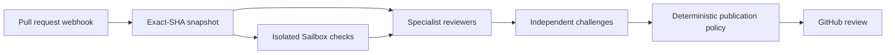

<div align="center">
  
  <h1>Gauntlet</h1>
  <p><strong>A review team for every pull request.</strong></p>
  <p>Specialist agents inspect the code. Independent agents challenge every finding. Developers see only the feedback that survives.</p>
  <p>
    <a href="https://github.com/Kylejeong2/gauntlet/actions/workflows/ci.yml"></a>
    <a href="LICENSE"></a>
    
    
  </p>
  <p><a href="https://github.com/apps/gauntlet-review-dev">GitHub App</a> · <a href="docs/setup.md">Setup</a> · <a href="docs/architecture.md">Architecture</a> · <a href="specs/gauntlet.product-spec.md">Product spec</a></p>
</div>

Gauntlet reviews public pull requests with DeepSeek V4 Flash through Sail. It runs repository checks in an isolated Sailbox, gives each specialist its own voice, and asks a separate model call to disprove every proposed finding. A deterministic policy layer decides what reaches GitHub.

The result reads like a careful team review, not a transcript of model guesses.

## What you get

|                       | Gauntlet's contract                                                                         |
| --------------------- | ------------------------------------------------------------------------------------------- |
| Review team           | Eight fixed specialists, with up to two extra specialists when the change needs them        |
| Independent challenge | Every candidate finding gets a separate attempt to disprove it                              |
| Pull request summary  | One overall score, a plain-language briefing, key risks, and recommended actions            |
| Specialist comments   | One readable top-level comment per reviewer, with its score and areas examined              |
| Inline findings       | At most five confirmed defects, attached to changed lines and attributed to their reviewers |
| Fix handoff           | Every comment includes a collapsed, copyable `Prompt to fix`                                |
| Cost                  | A hard estimated ceiling of $0.25 per pull request                                          |
| Execution             | Public repository code runs only in a credential-free Sailbox                               |

Gauntlet suppresses positive inline comments, style preferences, duplicates, stale findings, off-diff claims, and findings that fail verification.

## The review team

| Reviewer            | What it examines                                                      |
| ------------------- | --------------------------------------------------------------------- |
| Security            | Trust boundaries, injection, authorization, secrets, and exposure     |
| Performance         | Latency, memory, I/O, and algorithmic growth                          |
| API compatibility   | Public APIs, wire formats, schemas, and persisted contracts           |
| Adversarial testing | Inputs and sequences most likely to break the change                  |
| Documentation       | Accuracy, missing guidance, and migration requirements                |
| New-user simulation | Setup, discoverability, first-run behavior, and error messages        |
| Dependency history  | Version changes, known regressions, and reintroduced risks            |
| Edge cases          | Boundaries, lifecycle state, ordering, concurrency, and platform gaps |

Gauntlet can add test-quality and concurrency reviewers. A run uses no more than ten reviewers. Each reviewer assigns a readiness score from 1 to 5, where 5 means ready to merge from that viewpoint and 1 means a critical problem blocks a safe merge.

## How a review moves



The webhook handler records each eligible delivery before it returns. A leased worker then stores and reloads an immutable snapshot of the exact base and head commits. Paid work starts only after the complete worst-case plan fits within the run budget.

DeepSeek reviewers inspect the snapshot and bounded Sailbox evidence. Separate DeepSeek requests challenge their findings. Gauntlet rejects unconfirmed, duplicate, stale, and unanchorable claims before it publishes the specialist comments, the PR summary, and up to five inline findings.

Read [the architecture](docs/architecture.md) for the state model, database tables, recovery rules, and provider boundaries.

## Run Gauntlet

You need Node.js 22 or newer, pnpm 10.15.0 through Corepack, a GitHub App, a public test repository, and a Sail API key with access to DeepSeek V4 Flash and Sailboxes.

```bash
corepack enable
pnpm install --frozen-lockfile
cp .env.example .env
pnpm check
pnpm dev
```

Replace every placeholder in `.env` before you start the app. Never commit that file. The [GitHub App setup guide](docs/setup.md) lists the required permissions, webhook events, and local forwarding steps.

Gauntlet fixes the model to `deepseek/deepseek-v4-flash-0731`. It never switches models after a provider failure. See [Configuration](docs/configuration.md) for every environment variable and cost assumption.

## Security boundary

Pull request code is hostile input. The GitHub App host never checks it out or executes it. The Sailbox receives no GitHub token, App key, webhook secret, Sail key, host environment, host volume, or Docker socket.

Every repository command uses an argument array, a fixed working directory, an empty environment overlay, a timeout, and an output limit. Gauntlet rejects private repositories before inference or code execution.

Read [the security model](docs/security.md) for the threat model and operating controls.

## Verification

`pnpm check` runs formatting checks, ESLint, strict TypeScript checks, the deterministic test suite, and the production build. It does not contact GitHub or spend Sail credit. Live tests remain opt-in because they publish reviews and use paid services.

The repository keeps detailed evidence out of this front page:

| Document                                       | Use it for                                                   |
| ---------------------------------------------- | ------------------------------------------------------------ |
| [Testing](docs/testing.md)                     | Local commands, test coverage, and live test records         |
| [Acceptance status](docs/acceptance-status.md) | ProductSpec criteria and their current evidence              |
| [Operations](docs/operations.md)               | Run states, retries, duplicate prevention, and incidents     |
| [Reviewer reference](docs/reviewers.md)        | Scores, findings, challenges, ranking, and publication rules |
| [Prior art](docs/research/prior-art.md)        | Source-level research into earlier PR review systems         |

<details>
<summary>Repository layout</summary>

```text
src/
  adapters/        GitHub, Sail Responses, and Sailbox boundaries
  application/     Review orchestration and budget admission
  domain/          Schemas, reviewers, budgets, scheduling, and publication policy
  storage/         SQLite migrations, idempotency, leases, and reservations
tests/             Unit, SQLite integration, provider contract, and orchestration tests
docs/              Architecture, setup, security, operations, testing, and research
specs/             Product intent and acceptance criteria
```

</details>

## License

Gauntlet is available under the [MIT License](LICENSE).
