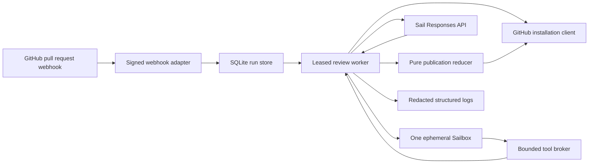
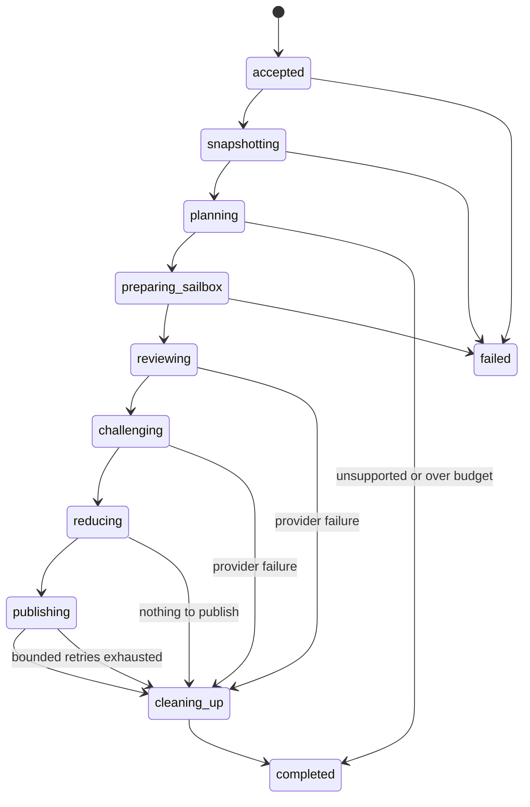

# Gauntlet architecture

Status: accepted design for ProductSpec revision 2. Implementation and live verification are tracked separately.

## Implemented foundation

The implementation provides the SDK-independent domain and SQLite foundation described here: branded boundary constructors, discriminated run states, the ten-entry reviewer registry, strict reviewer and finding schemas, the integer-microdollar budget policy, the pure challenge-gated publication reducer, structured-value redaction, `deriveNextWork`, direct migrations, and durable acceptance, lease, and budget-reservation operations.

Concrete adapters cover public GitHub exact-SHA comparison, immutable snapshot persistence, separate reviewer-comment publication, a compact finding review, an idempotent PR-description summary, DeepSeek V4 Flash through Sail's Responses API, and exact-head execution in one Sailbox. `DurableReviewEngine.advance` executes one leased phase and checkpoints reviewer reports, findings, challenges, summaries, Sailbox receipts, publication intent, and audit events before advancing. The authenticated webhook records the run and initial snapshot work atomically. Stable run, reviewer, Sailbox-name, and publication markers reconcile external effects after a crash. The installed-App flow has passed against vulnerable and clean public fixtures. [Testing Gauntlet](testing.md) records the evidence.

## What Gauntlet does

Gauntlet receives a public pull request webhook and reviews one immutable head commit. Eight core specialists inspect every eligible pull request. Each specialist publishes a separate readable GitHub review comment with its readiness score, rationale, and examined areas. Gauntlet can add test-quality and concurrency specialists when the diff calls for them. Every specialist returns a readiness score from 1 through 5 and at most three candidate findings.

A candidate finding is not a GitHub comment. A new DeepSeek V4 Flash request tries to disprove it. Gauntlet publishes only confirmed findings that point to changed lines in the exact reviewed head. Multi-specialist runs require same-line corroboration from two reviewers, except for critical findings with at least 0.9 confidence. Same-line duplicates collapse to the strongest evidence, and the final summary review contains at most five inline comments. The final review is deliberately brief, and a hidden-marker block adds or replaces one Gauntlet summary line in the PR description without changing the author's text.

## System map



The host control plane owns credentials and never executes pull request code. The Sailbox executes public code and receives no host credential. Sail receives bounded source context and bounded command evidence. SQLite owns durable run, budget, work, and publication state.

## Caller view

The GitHub adapter validates and durably accepts a webhook. It does not wait for code execution or inference.

```ts
const receipt = await acceptPullRequestWebhook({
  headers: request.headers,
  rawBody: await request.text(),
  receivedAt: clock.now(),
});

return new Response(null, {
  status: receipt.kind === "accepted" ? 202 : 204,
});
```

The worker repeatedly claims one phase work item and asks the deep execution module to advance it. The worker heartbeats long leases and schedules bounded retries; a restart reloads checkpoints and skips completed model work.

```ts
while (const lease = runs.claimNextWork({ workerId, nowMs: clock.now() })) {
  await engine.advance(lease);
}
```

The publication reducer is pure. It receives stored facts and returns either one publication plan or a skip reason.

```ts
const plan = reducePublication({ run, reports, challenges, priorFindings });

if (plan.kind === "publish") {
  await github.publishCommentReview(plan);
}
```

## Domain model

External JSON does not enter the review engine directly. Every adapter parses data into branded identifiers and discriminated states.

```ts
type RunId = Brand<string, "RunId">;
type DeliveryId = Brand<string, "DeliveryId">;
type InstallationId = Brand<number, "InstallationId">;
type RepositoryId = Brand<number, "RepositoryId">;
type PullNumber = Brand<number, "PullNumber">;
type CommitSha = Brand<string, "CommitSha">;
type ReviewerId = Brand<string, "ReviewerId">;
type FindingId = Brand<string, "FindingId">;
type SailboxId = Brand<string, "SailboxId">;
type UsdMicros = Brand<number, "UsdMicros">;
```

One run targets one tuple:

```text
installation ID + repository ID + pull request number + head SHA
```

The database enforces a unique constraint on that tuple. A second webhook delivery for the same head returns the existing run. A synchronize event with a new head creates a new run.

The immutable snapshot records these facts:

- The base SHA, head SHA, and merge-base SHA.
- Each changed file and its status.
- Every changed right-side line that can accept an inline comment.
- Patch text and bounded file context.
- Files or context omitted because of size, binary content, a missing GitHub patch, or the cost limit.

Gauntlet does not recompute the snapshot after reviewer work starts.

The GitHub adapter calls the commit-comparison endpoint with the accepted base and head SHAs. It does not call the mutable pull-request files endpoint. `SqliteRunStore.putSnapshotOnce` writes the header and ordered files in one transaction. The worker reloads the stored value before reviewer selection, Sailbox creation, or model inference. The 300-file comparison limit becomes an explicit coverage omission.

## Run lifecycle



Every transition and its follow-up work item commit in one SQLite transaction. A work item has a stable key, an owner, a lease deadline, an attempt count, a maximum-attempt limit, retry timing, and a terminal receipt. Heartbeats extend active work, expired leases return to the queue, and the third failed attempt dead-letters the phase into cleanup. Cleanup remains required after any state that may have created a Sailbox.

Reviewer reports and their findings commit together. Semantic duplicates within one report collapse to the strongest severity, confidence, and evidence before that atomic checkpoint. Challenge verdicts and final synthesis are put-once checkpoints: an equal retry reuses the stored value and a conflicting retry fails closed. A process restart can therefore repeat at most the currently uncheckpointed external request rather than the complete review.

Sailbox creation writes a deterministic-name intent before contacting Sail. Recovery searches that exact name before creating another box, can reattach by persisted ID, verifies the checked-out head, and records termination. GitHub publication writes a body digest and the current worker-attempt claim before submission, renews the work lease for a bounded publication window, and searches the stable run marker before retrying. A compare-and-set receipt update rejects a publisher whose claim was superseded. These reconciliation paths close the two external side-effect windows that cannot be covered by a local transaction.

## Reviewer organization

The registry is the single source of truth for reviewer names, prompts, applicable file signals, allowed tools, and output schema.

| Reviewer | Main question | Typical execution |
| --- | --- | --- |
| Security | Can an attacker cross a trust boundary or control a sensitive operation? | Search sinks and run a bounded exploit reproduction. |
| Performance | Can the change cause material latency, memory, I/O, or algorithmic growth? | Run a focused benchmark or inspect hot loops. |
| API compatibility | Does the change break a public caller, wire format, or persisted contract? | Compile a small consumer or compare exported types. |
| Adversarial testing | Which hostile or malformed input breaks the new behavior? | Run malformed, boundary, and state-order cases. |
| Documentation | Do the docs match the implemented behavior and required migration steps? | Run examples and compare documented commands. |
| New-user simulation | Can a new contributor follow the public setup from a clean checkout? | Follow README commands and record the first failure. |
| Dependency history | Does a dependency change reintroduce a known problem or violate the repository's version policy? | Inspect manifests, lockfiles, changelogs, and call sites. |
| Edge cases | Which boundary value, lifecycle state, platform, or concurrency order is missing? | Run narrow reproductions against changed code. |
| Test quality | Do the tests prove the changed contract and fail for the intended reason? | Run focused tests and inspect assertions. |
| Concurrency | Can retries, parallel calls, or process crashes corrupt shared state? | Run repeated or parallel reproductions. |

The first eight reviewers run for every eligible pull request. The planner can add the final two. The hard maximum is ten.

Each reviewer returns this shape:

```ts
type ReviewerReport = Readonly<{
  reviewer: ReviewerId;
  readiness: 1 | 2 | 3 | 4 | 5;
  rationale: string;
  examinedAreas: readonly string[];
  findings: readonly CandidateFinding[];
}>;
```

The schema permits zero through three findings. A malformed report is an internal coverage omission. Gauntlet never invents a score or finding to repair it.

## Reviewer tool loop

Sail supports client-side function tools. Each reviewer can ask the Gauntlet host to perform a bounded operation in the Sailbox. The model never receives an unrestricted shell tool.

The first release exposes four tools:

- `read_file` reads a repository-relative path and a bounded line range.
- `search_files` runs fixed-string search with bounded paths, matches, and output.
- `run_project_command` runs one command discovered from a supported manifest and approved by policy.
- `run_reproduction` writes a bounded TypeScript, JavaScript, or Python file into a reviewer-specific temporary directory and executes it without host credentials.

Each reviewer gets at most three tool calls and four model turns. Each command has an argument-vector representation, a timeout, and an output-byte limit. The broker serializes commands against the shared repository checkout and gives reproductions separate temporary directories. It resets the exact head checkout after any project command.

The broker rejects these requests:

- Shell strings, pipes, redirects, or command substitution.
- Executables outside the allowlist.
- Absolute paths, parent-directory traversal, symlink escape, or oversized files.
- Environment keys outside a small fixed set.
- More than the command, time, turn, output, or cost limit.

The application records command ID, reviewer ID, executable, argument digest, duration, exit code, timeout state, output sizes, and redaction count. It does not log full command output.

## Sailbox execution

Each run creates one size `s` Sailbox and terminates it after publication or failure. The Sailbox receives a public repository URL, the exact head SHA, and the persisted merge-base SHA. Every diff and dependency-evidence command uses `merge-base..head`, so an advancing base branch cannot contaminate the review with unrelated changes. It receives no GitHub App ID, installation token, private key, webhook secret, Sail key, host environment, host volume, or Docker socket.

The preparation sequence is deterministic:

1. Create the Sailbox and persist its ID.
2. Clone the public repository without credentials.
3. Fetch and check out the exact head SHA.
4. Verify that `git rev-parse HEAD` equals the stored head SHA.
5. Detect the package manager from committed lockfiles.
6. Install frozen dependencies with lifecycle scripts disabled.
7. Discover supported scripts from parsed manifests.
8. Run baseline test, lint, typecheck, build, and documentation commands when they exist.
9. Serve bounded reviewer tool requests.
10. Terminate the Sailbox and persist the termination receipt.

The host never executes repository commands. An unsupported setup becomes a coverage omission rather than a host fallback.

## Finding and challenge model

A finding contains a deterministic ID, reviewer, changed-line location, severity, confidence, title, concrete trigger, evidence, and proposed action. The ID uses the run, reviewer, normalized location, and normalized trigger. It does not depend on prose alone.

Each finding schedules one separate challenge request. The challenge receives the claim, exact changed-line context, cited evidence, relevant command facts, and the immutable snapshot. It does not receive the reviewer's hidden reasoning or another reviewer's verdict.

Challenge outcomes are:

- `confirmed` means that evidence supports the concrete failure.
- `rejected` means that context or execution disproves the claim.
- `inconclusive` means that the challenge could not establish the claim.

Only `confirmed` can reach publication. Missing, failed, malformed, budget-denied, and inconclusive challenges act as rejected outcomes.

## Budget authority

The budget uses integer microdollars. The hard limit is 250,000 microdollars, which equals $0.25.

The planner reserves a conservative maximum for the entire mandatory run before creating a Sailbox. The reservation includes:

- One size `s` Sailbox creation.
- The configured maximum Sailbox runtime at the configured CPU, memory, and disk ceilings.
- Sailbox termination allowance.
- Up to ten reviewers.
- Four model turns and three tool calls per reviewer.
- Up to three challenges per reviewer.
- One final structured synthesis request after all reports and challenges complete.
- GitHub publication and cleanup work that does not have a provider token charge.

The DeepSeek V4 Flash estimate ignores cached-input discounts. It uses the full input rate, the bounded input size, and the maximum output size. Provider usage settles a reservation when usage is present. Missing usage retains the conservative estimate.

The planner does not start a partial organization. If the full worst-case plan cannot fit, Gauntlet records `budget_exhausted` before paid work begins.

## Publication policy

`reducePublication` performs these deterministic checks:

1. Require one valid score for every selected reviewer, but treat it as 5/5 unless that reviewer has a challenge-confirmed finding on a changed line.
2. Keep only confirmed findings.
3. Validate every path and right-side line against the immutable snapshot.
4. Group semantic duplicates and retain the finding with stronger evidence.
5. Remove stable identities already published for the same pull request when the defect did not materially change.
6. Sort by severity, confidence, evidence quality, and finding ID.
7. Keep the first five findings.
8. Attribute each inline finding to its originating specialist.
9. Render one COMMENT review per specialist, followed by a compact final review containing a short synthesis, one-decimal arithmetic mean, one top risk, one next action, coverage omissions, cost, duration, and verified inline findings.
10. Add a collapsed copyable `Prompt to fix` to specialist comments with an actionable score below 5/5 and every verified inline finding. The final summary never contains a fix prompt.
11. Add or replace one hidden-marker Gauntlet note in the pull request description. Preserve all author-written content and collapse the generated headline to one line.

Each inline body includes a hidden stable identity. A synchronize run can reconcile earlier Gauntlet feedback without trusting stale line numbers.

The GitHub adapter checks the current head, then creates one COMMENT review with all validated comments. A hidden run marker lets a recovered worker find a review that GitHub accepted before the local completion write. The adapter never falls back to a visible flood of individual comments.

## Ports

| Port | Responsibility |
| --- | --- |
| `RunStore` | Accept runs, claim leases, persist snapshots, work, budgets, reports, challenges, Sailboxes, and publication receipts. |
| `GitHubPort` | Fetch the immutable snapshot, mint installation clients, reconcile prior finding identities, update the marked PR-description summary, and publish idempotent reviewer comments plus one summary review. |
| `ModelPort` | Run serialized DeepSeek V4 Flash reviewer, challenge, and final synthesis requests with strict schemas and typed response parsing. |
| `SailboxPort` | Create, execute bounded argument-vector commands, inspect lifecycle, and terminate. |
| `BudgetLedger` | Reserve, settle, and report microdollar costs under one transaction owner. |
| `Clock` | Make leases, durations, and retry tests deterministic. |
| `Logger` | Emit correlated redacted events without source or secrets. |

The domain imports no GitHub, OpenAI, Sail, Sailbox, SQLite, or logging SDK.

## SQLite schema

| Table | Durable purpose |
| --- | --- |
| `webhook_deliveries` | Delivery identity, body digest, eligibility result, and redacted reason. |
| `review_runs` | Unique immutable target, lifecycle, lease, plan, and final outcome. |
| `snapshots` and `snapshot_files` | Base, head, merge-base, changed lines, patches, and omissions. |
| `work_items` | Stable effect keys, leases, attempts, retries, and receipts. |
| `reviewer_reports` | One validated report per selected reviewer. |
| `findings` and `challenge_verdicts` | Candidate lineage and terminal challenge outcome. |
| `budget_reservations` | Reserved and settled microdollar amounts by work item. |
| `sailboxes` | Sailbox ID, status, creation receipt, and termination receipt. |
| `publications` | Stable publication key, body digest, current worker-attempt claim, GitHub review ID, and submit result. |
| `run_events` | Append-only redacted audit facts for state transitions and important decisions. |

SQLite uses WAL mode, foreign keys, a busy timeout, and explicit migrations. Normalized tables remain authoritative. `run_events` is an audit record, not an event-sourced state authority.

## Pure scheduling policy

`deriveNextWork(view, now)` receives a stored run view and returns the next admissible work. The function is pure and deterministic. It never performs I/O.

This seam gives tests direct control over crash, retry, missing report, budget, and cleanup cases without adopting a full event-sourced architecture. The worker executes returned work and writes receipts through `RunStore`.

## Logging

Every event includes the applicable identifiers:

- Delivery, run, installation, repository, pull request, and head SHA.
- Reviewer, finding, challenge, tool call, Sail response, Sailbox, work item, and publication.
- State transition, attempt, lease owner, duration, token counts, estimated cost, exit code, and result.

The logger removes credentials, environment values, authorization headers, private keys, full source, and full command output. Tests feed canary secrets through every boundary and assert that neither logs nor stored errors contain them.

## Verification layers

Unit tests cover pure selector, command, budget, location, challenge, deduplication, ranking, rendering, and redaction policy.

SQLite integration tests cover duplicate deliveries, same-head deliveries, new-head runs, competing workers, expired leases, crash recovery, atomic reservations, orphaned Sailbox cleanup, and pending GitHub review recovery.

Contract tests cover GitHub webhook fixtures, signatures, pagination, review payloads, Sail structured responses and usage, Sailbox create and command results, and all strict schemas.

Fixture evaluations cover the three ProductSpec AI eval groups. Live tests use only the public Gauntlet repository and opt-in credentials. The completed 2026-08-22 installed-App gate followed signed webhooks through the then-current GPT-OSS configuration, real Sailboxes, and visible GitHub reviews, then confirmed termination, reported cost, clean-change suppression, and same-head idempotency. The fixed DeepSeek V4 Flash request contract was live-verified separately on 2026-08-23; a new installed-App fixture run remains a distinct release gate.

## Accepted tradeoffs

- SQLite limits the first release to a single durable host in exchange for simple transactional deployment.
- One Sailbox serializes project commands in exchange for a lower creation cost and a simpler evidence record.
- Lifecycle scripts stay disabled during dependency installation. Some repositories will report incomplete execution coverage.
- Reviewer and challenger use the same model in the first release. Separate prompts and context reduce correlation but do not create model diversity.
- The local ledger reports a conservative estimate. It does not claim to equal settled Sail billing.
